# Fluxo de Usuários - Sistema DIPE

```mermaid
flowchart TD
    %% Entrada no Sistema
    A[Usuário Acessa Sistema] --> B{Tipo de Acesso}
    B -->|Primeiro Acesso| C[Cadastro de Usuário]
    B -->|Usuário Existente| D[Login]
    
    %% Cadastro
    C --> C1[Preencher Email e Senha]
    C1 --> C2[Criar Conta Usuário]
    C2 --> C3{Tipo de Usuário}
    C3 -->|Aluno| C4[Cadastro Completo Aluno]
    C3 -->|Professor| C5[Cadastro Completo Professor]
    C3 -->|Gestor| C6[Cadastro Completo Gestor]
    
    %% Login
    D --> D1[Verificar Credenciais]
    D1 -->|Inválidas| D2[Erro: Email/Senha Inválidos]
    D2 --> D
    D1 -->|Válidas| D3{Tipo de Usuário}
    
    %% Redirecionamento por Tipo
    D3 -->|Aluno| E[Área do Aluno]
    D3 -->|Professor| F[Área do Professor]
    D3 -->|Gestor| G[Área do Gestor]
    
    %% FLUXO DO ALUNO
    E --> E1[Dashboard/Perfil Aluno]
    E1 --> E2[Visualizar Desempenho]
    E1 --> E3[Gerenciar Turmas]
    E1 --> E4[Responder Provas]
    E1 --> E5[Responder Formulários]
    E1 --> E6[Editar Dados Pessoais]
    E1 --> E7[Visualizar Notificações]
    
    %% Sub-fluxos do Aluno
    E2 --> E2A[Gráficos de Desempenho]
    E2A --> E2B[Análise por Disciplina]
    E2B --> E2C[Progressão Individual]
    
    E3 --> E3A[Entrar em Turma]
    E3A --> E3B[Inserir Código da Turma]
    E3B --> E3C[Verificar Código]
    E3C -->|Válido| E3D[Adicionado à Turma]
    E3C -->|Inválido| E3E[Erro: Código Inválido]
    E3E --> E3A
    
    E4 --> E4A[Listar Provas Disponíveis]
    E4A --> E4B{Status da Prova}
    E4B -->|Ativa| E4C[Responder Prova]
    E4B -->|Expirada| E4D[Consultar Prova]
    E4B -->|Já Respondida| E4E[Ver Resultado]
    
    E4C --> E4C1[Exibir Questões]
    E4C1 --> E4C2[Aluno Responde]
    E4C2 --> E4C3[Salvar Respostas]
    E4C3 --> E4C4[Calcular Nota]
    E4C4 --> E4C5[Determinar Situação]
    E4C5 --> E4C6[Salvar Resultado]
    E4C6 --> E4C7[Redirecionar com Sucesso]
    
    E5 --> E5A[Listar Formulários Pendentes]
    E5A --> E5B[Selecionar Formulário]
    E5B --> E5C[Responder Perguntas]
    E5C --> E5D[Enviar Respostas]
    E5D --> E5E[Marcar Notificação como Lida]
    E5E --> E5F[Redirecionar com Sucesso]
    
    %% FLUXO DO PROFESSOR
    F --> F1[Dashboard Professor]
    F1 --> F2[Gerenciar Turmas]
    F1 --> F3[Banco de Questões]
    F1 --> F4[Criar Provas]
    F1 --> F5[Visualizar Resultados]
    F1 --> F6[Gerenciar Notificações]
    
    %% Sub-fluxos do Professor
    F2 --> F2A[Listar Turmas]
    F2A --> F2B[Criar Nova Turma]
    F2B --> F2C[Definir Dados da Turma]
    F2C --> F2D[Gerar Código da Turma]
    F2D --> F2E[Salvar Turma]
    F2A --> F2F[Gerenciar Turma Existente]
    F2F --> F2G[Adicionar/Remover Alunos]
    F2F --> F2H[Definir Provas da Turma]
    
    F3 --> F3A[Listar Questões]
    F3A --> F3B[Criar Nova Questão]
    F3B --> F3C[Definir Enunciado]
    F3C --> F3D[Definir Alternativas]
    F3D --> F3E[Definir Resposta Correta]
    F3E --> F3F[Definir Matéria]
    F3F --> F3G[Salvar Questão]
    F3A --> F3H[Buscar por Matéria]
    F3A --> F3I[Editar Questão Existente]
    
    F4 --> F4A[Selecionar Questões]
    F4A --> F4B[Definir Título da Prova]
    F4B --> F4C[Definir Matéria]
    F4C --> F4D[Associar à Turma]
    F4D --> F4E[Definir Prazo]
    F4E --> F4F[Salvar Prova]
    F4F --> F4G[Notificar Alunos]
    
    F5 --> F5A[Listar Provas Criadas]
    F5A --> F5B[Selecionar Prova]
    F5B --> F5C[Ver Resultados dos Alunos]
    F5C --> F5D[Análise de Desempenho]
    F5D --> F5E[Exportar Relatórios]
    
    %% FLUXO DO GESTOR
    G --> G1[Dashboard Gestor]
    G1 --> G2[Análise Geral do Sistema]
    G1 --> G3[Gerenciar Usuários]
    G1 --> G4[Gerenciar Campus]
    G1 --> G5[Criar Formulários]
    G1 --> G6[Relatórios e Estatísticas]
    G1 --> G7[Monitorar Atividades]
    
    %% Sub-fluxos do Gestor
    G2 --> G2A[Métricas de Desempenho]
    G2A --> G2B[Distribuição de Notas]
    G2B --> G2C[Comparação entre Turmas]
    G2C --> G2D[Taxa de Participação]
    
    G3 --> G3A[Listar Todos os Usuários]
    G3A --> G3B[Cadastrar Novo Aluno]
    G3B --> G3C[Definir Dados do Aluno]
    G3C --> G3D[Associar à Turma]
    G3D --> G3E[Salvar Aluno]
    G3A --> G3F[Cadastrar Novo Professor]
    G3F --> G3G[Definir Dados do Professor]
    G3G --> G3H[Associar ao Campus]
    G3H --> G3I[Salvar Professor]
    G3A --> G3J[Gerenciar Permissões]
    
    G4 --> G4A[Listar Campus]
    G4A --> G4B[Criar Novo Campus]
    G4B --> G4C[Definir Dados do Campus]
    G4C --> G4D[Salvar Campus]
    G4A --> G4E[Gerenciar Campus Existente]
    G4E --> G4F[Associar Professores]
    G4E --> G4G[Gerenciar Turmas]
    
    G5 --> G5A[Listar Formulários]
    G5A --> G5B[Criar Novo Formulário]
    G5B --> G5C[Definir Título e Descrição]
    G5C --> G5D[Criar Perguntas]
    G5D --> G5E[Definir Tipo de Pergunta]
    G5E --> G5F[Definir Opções se Múltipla Escolha]
    G5F --> G5G[Salvar Formulário]
    G5G --> G5H[Notificar Todos os Alunos]
    
    G6 --> G6A[Relatórios de Desempenho]
    G6A --> G6B[Relatórios por Disciplina]
    G6B --> G6C[Relatórios por Turma]
    G6C --> G6D[Relatórios por Campus]
    G6D --> G6E[Exportar Dados]
    
    %% SISTEMA DE NOTIFICAÇÕES
    N1[Sistema de Notificações] --> N2{Tipo de Notificação}
    N2 -->|Formulário Pendente| N3[Notificar Aluno]
    N2 -->|Prova Criada| N4[Notificar Alunos da Turma]
    N2 -->|Resultado Disponível| N5[Notificar Aluno]
    
    N3 --> N6[Aluno Visualiza Notificação]
    N6 --> N7[Aluno Responde Formulário]
    N7 --> N8[Marcar Notificação como Lida]
    
    %% LOGOUT
    E1 --> LOGOUT[Logout]
    F1 --> LOGOUT
    G1 --> LOGOUT
    LOGOUT --> A
    
    %% Estilos
    classDef aluno fill:#e1f5fe,stroke:#01579b,stroke-width:2px
    classDef professor fill:#f3e5f5,stroke:#4a148c,stroke-width:2px
    classDef gestor fill:#e8f5e8,stroke:#1b5e20,stroke-width:2px
    classDef sistema fill:#fff3e0,stroke:#e65100,stroke-width:2px
    
    class E,E1,E2,E3,E4,E5,E6,E7,E2A,E2B,E2C,E3A,E3B,E3C,E3D,E3E,E4A,E4B,E4C,E4D,E4E,E4C1,E4C2,E4C3,E4C4,E4C5,E4C6,E4C7,E5A,E5B,E5C,E5D,E5E,E5F aluno
    class F,F1,F2,F3,F4,F5,F6,F2A,F2B,F2C,F2D,F2E,F2F,F2G,F2H,F3A,F3B,F3C,F3D,F3E,F3F,F3G,F3H,F3I,F4A,F4B,F4C,F4D,F4E,F4F,F4G,F5A,F5B,F5C,F5D,F5E professor
    class G,G1,G2,G3,G4,G5,G6,G7,G2A,G2B,G2C,G2D,G3A,G3B,G3C,G3D,G3E,G3F,G3G,G3H,G3I,G3J,G4A,G4B,G4C,G4D,G4E,G4F,G4G,G5A,G5B,G5C,G5D,G5E,G5F,G5G,G5H,G6A,G6B,G6C,G6D,G6E gestor
    class A,B,C,D,D1,D2,D3,C1,C2,C3,C4,C5,C6,LOGOUT,N1,N2,N3,N4,N5,N6,N7,N8 sistema
```

## Descrição dos Fluxos Principais

### 🔐 **Autenticação e Cadastro**
- **Entrada**: Usuário acessa o sistema
- **Cadastro**: Criação de conta com email/senha e definição do tipo de usuário
- **Login**: Verificação de credenciais e redirecionamento baseado no tipo

### 👨‍🎓 **Fluxo do Aluno**
1. **Dashboard/Perfil**: Visualização de dados pessoais e desempenho
2. **Gerenciar Turmas**: Entrar em turmas usando códigos
3. **Responder Provas**: Acessar provas ativas, responder questões e ver resultados
4. **Formulários**: Responder formulários pendentes e visualizar notificações
5. **Dados Pessoais**: Editar informações do perfil

### 👨‍🏫 **Fluxo do Professor**
1. **Dashboard**: Visão geral de turmas, questões e provas
2. **Gerenciar Turmas**: Criar turmas, gerar códigos e gerenciar alunos
3. **Banco de Questões**: Criar, editar e organizar questões por matéria
4. **Criar Provas**: Selecionar questões e associar a turmas
5. **Resultados**: Analisar desempenho dos alunos e gerar relatórios

### 👨‍💼 **Fluxo do Gestor**
1. **Dashboard**: Métricas gerais do sistema e análises
2. **Gerenciar Usuários**: Cadastrar alunos e professores
3. **Gerenciar Campus**: Criar e administrar campus
4. **Formulários**: Criar formulários para coleta de dados
5. **Relatórios**: Análises detalhadas e exportação de dados

### 🔔 **Sistema de Notificações**
- Notificações automáticas para formulários pendentes
- Avisos sobre novas provas
- Alertas sobre resultados disponíveis
- Sistema de marcação de notificações como lidas

### 🚪 **Logout**
- Encerramento de sessão disponível em todas as áreas
- Retorno à tela de login
