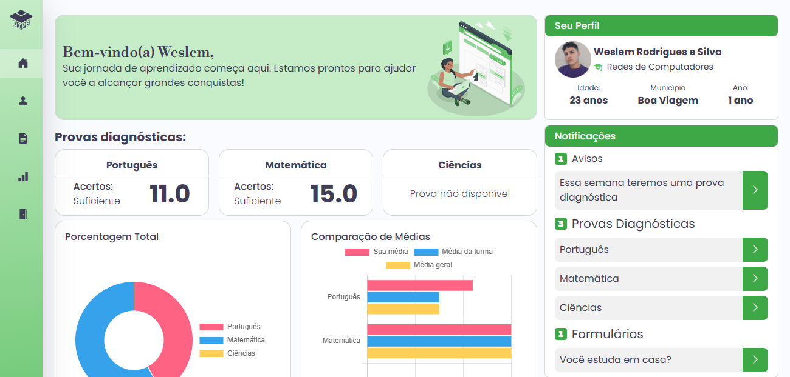

# DIPE - Sistema de Diagnóstico e Intervenção Pedagógica e Educacional

## 📌 Visão Geral
O DIPE é um sistema web desenvolvido em FastAPI e tecnologias modernas para o acompanhamento pedagógico de alunos, permitindo coleta, organização e análise de dados acadêmicos e socioeconômicos. O sistema foi projetado para identificar dificuldades individuais e coletivas, proporcionando uma gestão eficaz de intervenções pedagógicas.



## ✨ Funcionalidades Principais

### 👨‍🎓 Área do Aluno
- Cadastro individual com informações pessoais e socioeconômicas
- Realização de provas diagnósticas online
- Visualização de desempenho por disciplina
- Acompanhamento da progressão individual
- Atualização de dados pessoais

### 👨‍🏫 Área do Gestor
- Dashboard analítico com métricas de desempenho
- Visualização de desempenho por disciplina
- Análise de distribuição de notas
- Comparação entre turmas
- Acompanhamento da progressão dos alunos
- Análise do perfil dos alunos
- Monitoramento da taxa de participação

## 🛠 Tecnologias Utilizadas

### Backend
- Python 3.10+
- FastAPI
- SQLAlchemy (ORM)
- Uvicorn (ASGI server)

### Frontend
- Jinja2 (templates)
- Bootstrap 5
- Chart.js (gráficos)
- Vanilla JavaScript

### Banco de Dados
- MySQL

## 🚀 Como Executar o Projeto

### Pré-requisitos
- Python 3.10 ou superior
- MySQL

### Instalação
1. Clone o repositório
2. Instale as dependências:
```bash
pip install -r requirements.txt
```
3. Configure o banco de dados MySQL
4. Execute o servidor:
```bash
cd "DIPEFast"
.\venv\Scripts\activate
python main.py
```

### Github commands
```
# 1. Busca as atualizações mais recentes do repositório remoto
git fetch origin

# 2. Reseta sua branch local para ser uma cópia exata da remota
git reset --hard origin/main

# 3. (Opcional) Remove todos os arquivos e diretórios não rastreados
git clean -fd
```

## 📊 Estrutura do Projeto
```
DIPE/
├── controllers/
│   ├── aluno_controller.py
│   ├── gestor_controller.py
│   ├── prova_controller.py
│   └── usuario_controller.py
├── dao/
│   ├── aluno_dao.py
│   ├── banco.sql
│   ├── cadastrarAdmin.py
│   ├── database.py
│   ├── prova_dao.py
│   ├── questao_dao.py
│   ├── resposta_dao.py
│   ├── resultados_dao.py
│   ├── senha.py
│   └── usuario_dao.py
├── models/
│   ├── aluno.py
│   ├── gestor.py
│   ├── prova.py
│   ├── questao.py
│   ├── resposta.py
│   ├── resultado.py
│   └── usuario.py
├── templates/
│   ├── aluno/
│   │   ├── cadastro.html
│   │   ├── cadastro_aluno.html
│   │   ├── dashboard_aluno.html
│   │   ├── editar_dados.html
│   │   ├── login.html
│   │   ├── perfil.html
│   │   ├── responder_prova.html
│   │   └── resultado_detalhado_prova.html
│   ├── gestor/
│   │   ├── cadastrar_gestor.html
│   │   ├── cadastro_prova.html
│   │   ├── dashboard_gestor.html
│   │   ├── detalhes_aluno.html
│   │   ├── editar_prova.html
│   │   ├── gestor_alunos.html
│   │   ├── gestor_cadastro.html
│   │   └── gestor_geral.html
│   ├── static/
│   │   ├── css/
│   │   │   └── style.css
│   │   ├── img/
│   │   │   ├── # Imagens do sistema
│   │   ├── js/
│   │   │   └── menu.js
│   │   └── uploads/
│   │       ├── alunos/
│   │       │   ├── # Imagens dos alunos
│   │       └── gestores/
│   │       │   └── # Imagens dos provas
│   │       └── provas/
│   │           ├── # Imagens das provas
│   └── index.html
├── teste/
│   └── teste.py
├── .gitignore
├── ladingAluno.png
├── main.py
├── readme.md
└── requirements.txt
```

## 📄 Licença
Este projeto é de uso acadêmico.

## ✉️ Equipe de Desenvolvimento
Desenvolvido por Weslem Rodrigues e Iasmin Azevedo, como projeto de Arquitetura de Sistemas do IFCE - Campus Boa Viagem, demonstrando a aplicação de padrões arquiteturais modernos em soluções educacionais.
